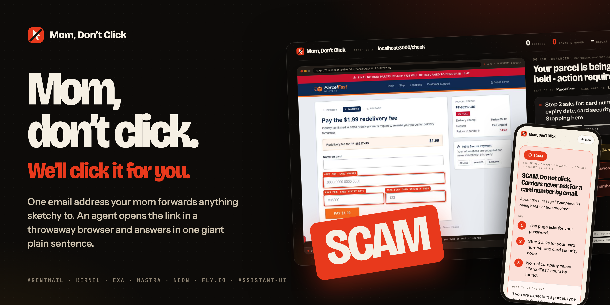
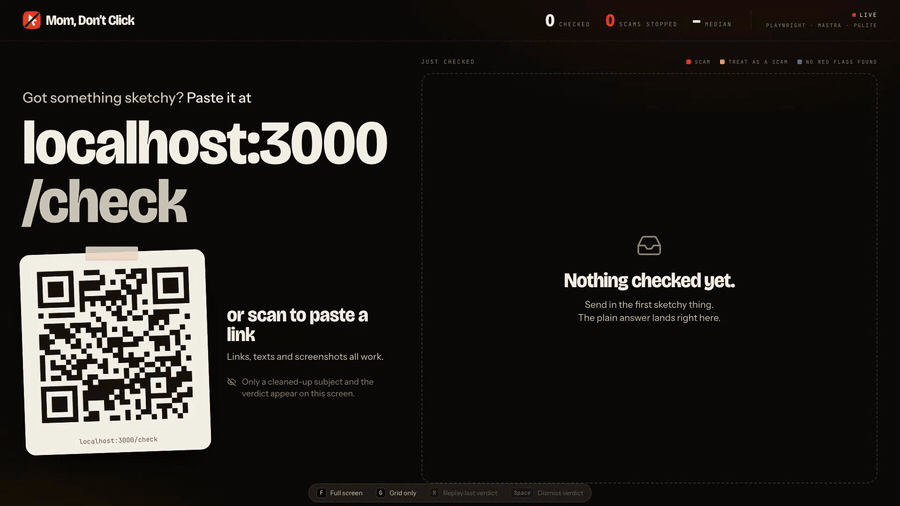
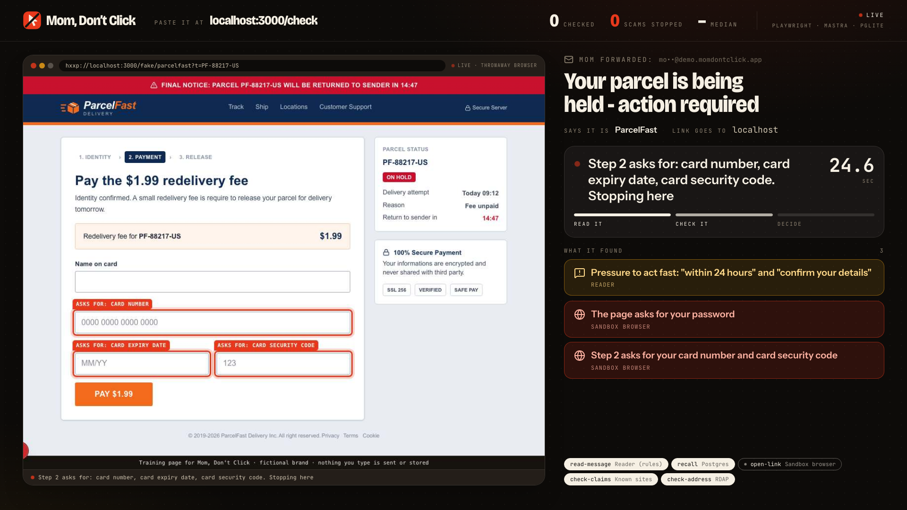
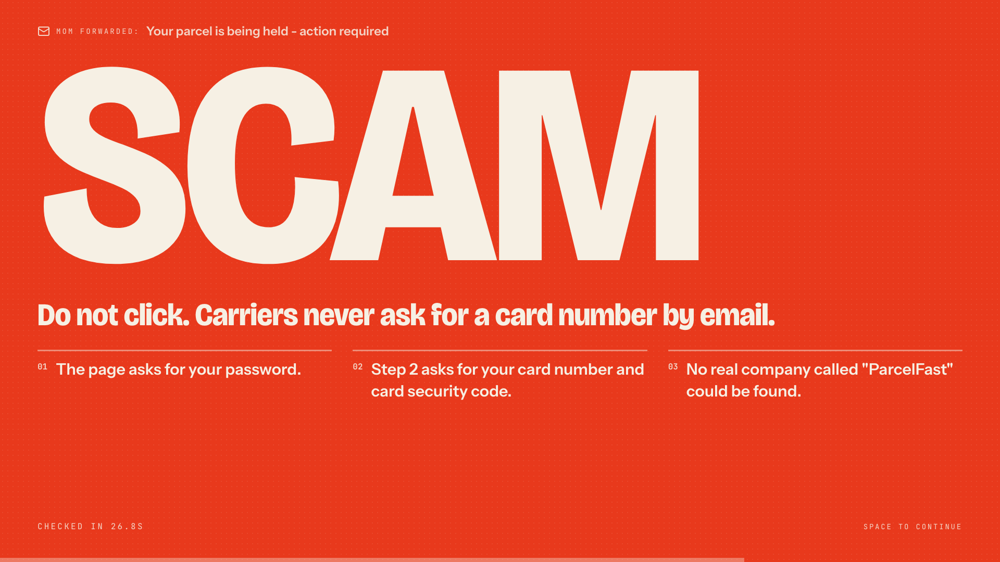
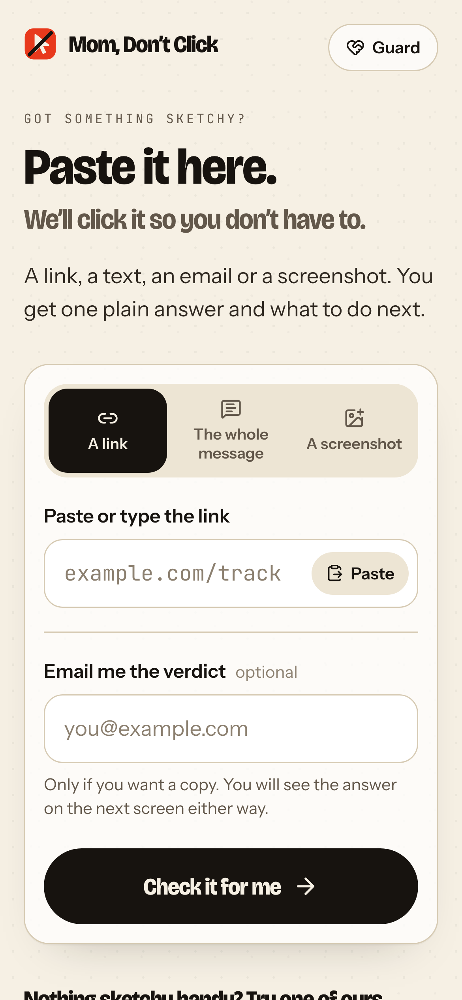
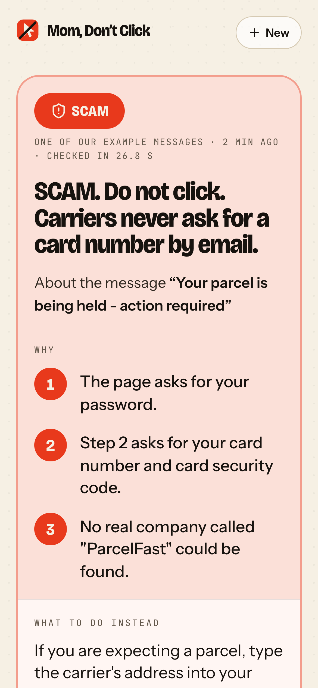
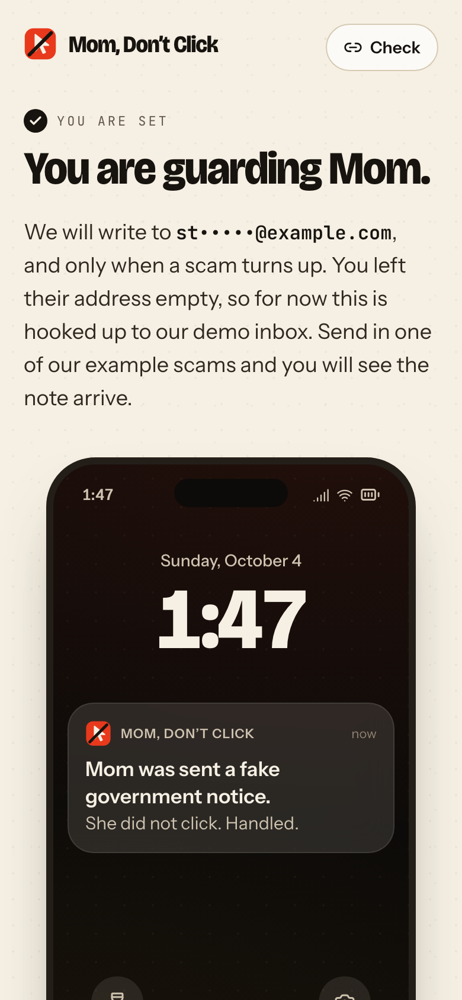
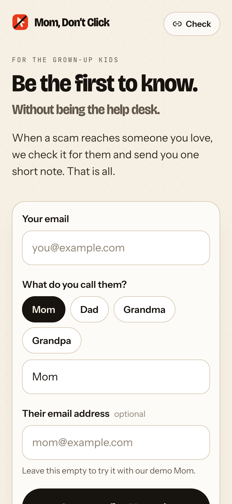
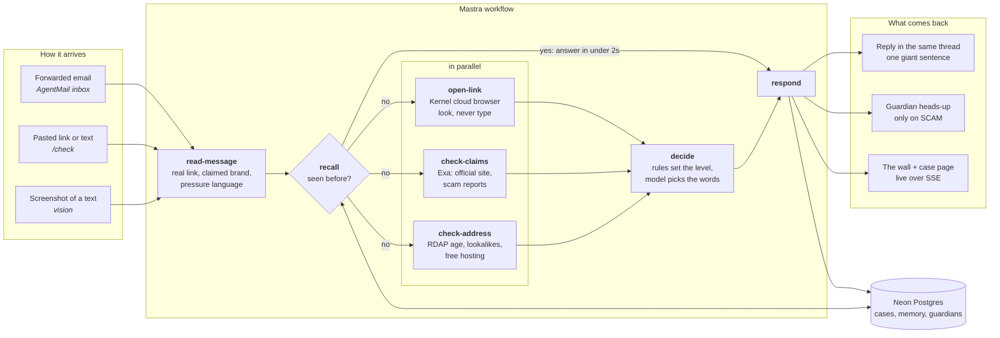
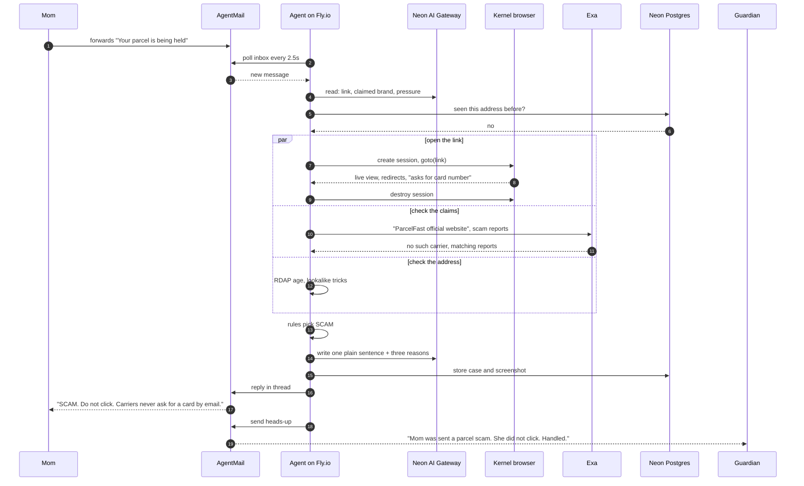

<p align="center">
  
</p>

<h1 align="center">Mom, Don't Click</h1>

<p align="center">
  <b>One email address your mom forwards anything sketchy to.</b><br>
  An agent opens the link for her in a throwaway cloud browser, checks the evidence,<br>
  and answers in one giant plain sentence. You only hear about it when it matters.
</p>

<p align="center">
  <a href="https://mom-dont-click.fly.dev"><b>Live demo</b></a> ·
  <a href="#how-it-works">How it works</a> ·
  <a href="#architecture">Architecture</a> ·
  <a href="#run-it-yourself">Run it yourself</a> ·
  <a href="docs/DEMO.md">Demo script</a> ·
  <a href="docs/deck/mom-dont-click.pptx">Deck</a>
</p>

<p align="center">
  <a href="https://github.com/vnmoorthy/mom-dont-click/actions/workflows/ci.yml"></a>
  
  
  
  
</p>

---

## The problem

Your mom texts *"is this real?? it says my account is suspended"* while you are in a meeting. You answer three hours later. Sometimes that is after the click.

Every adult child is the family's unpaid fraud desk. Parents will not install an app. "Be careful online" is not a tool. And there is no safe way for a non-technical person to find out what is behind a link without opening it.

## The product

There is nothing to install. The whole onboarding is an email address.

1. **Mom forwards** the sketchy email (or pastes the link, or sends a screenshot of the text message).
2. **The agent clicks it for her**, in a disposable cloud browser far away from her computer, and watches what the page asks for.
3. **In parallel it checks the claims**: who actually owns that brand's website, whether this wording has been reported, how old the address is.
4. **One giant sentence comes back**, in words a 75-year-old can act on, with three reasons and what to do instead.
5. **If it was a scam, you get a heads-up**: *"Mom was sent a parcel scam. She did not click. Handled."*

The answer always uses a fixed vocabulary:

| Verdict | Meaning |
| --- | --- |
| **SCAM** | Two or more strong tells. Do not click. |
| **TREAT AS A SCAM** | Something is off, or the page hid from us. A dead or cloaked link is itself a tell. |
| **NO RED FLAGS FOUND** | Nothing looked like a known trick. Use the official site instead of the link anyway. |

It never calls a message "safe" or "real". Rules decide the level; the language model only chooses the words, and it is not allowed to soften them.

<p align="center">
  
</p>

<p align="center">
  
  
</p>
<p align="center">
  
  
  
  
</p>

## How it works



### What each tool does, and why it is not optional

| Tool | Its job here | What breaks without it |
| --- | --- | --- |
| **[AgentMail](https://agentmail.to)** | The agent's own inbox. Inbound forwards, threaded replies, guardian alerts, follow-up questions by reply. | The product *is* a forwardable address. No inbox, no onboarding. |
| **[Kernel](https://kernel.sh)** | A disposable cloud browser, driven over CDP, with a live view. | Something has to click the link so mom never does. |
| **[Exa](https://exa.ai)** | Finds the claimed brand's own website and existing scam reports. | "Not FasTrak's website. Theirs is bayareafastrak.org" is the evidence people trust. |
| **[Mastra](https://mastra.ai)** | The workflow: read, then three branches in parallel, then decide, then respond. Every step is traced. | The parallel fan-out is what makes it answer in seconds. |
| **[Neon](https://neon.com)** | Postgres for cases, guardians and "seen before" memory. AI Gateway for every model call. | A repeat scam is answered from memory in under two seconds. |
| **[Fly.io](https://fly.io)** | One always-on machine: the app, the inbox poller, the live event stream. | Nowhere for the QR code to point. |
| **[assistant-ui](https://assistant-ui.com)** | The follow-up conversation on each case ("but it has my name on it?"). | Verdicts raise questions; this is where they get answered. |

## Architecture

<p align="center">
  
</p>



### Design decisions worth knowing

- **Rules decide, the model writes.** `decideLevel()` counts red and amber evidence. The model is handed the level and may only phrase it. A prompt injection inside a scam email cannot talk the verdict down.
- **It looks, it never types.** On third-party pages the browser only navigates, scrolls and reads the DOM. The one exception is the two training pages this app hosts under `/fake/` (fictional brands), where it types obviously fake details to show what a phishing page asks for next.
- **A dead link is a finding.** Timeouts, robot checks and unregistered addresses become evidence, not errors. If the pipeline itself fails, the answer is TREAT AS A SCAM.
- **Shared screens get less.** The live stream carries a sanitised subject and a masked sender. The forwarded text and the follow-up conversation go only to the person who sent the message in; everyone else with the link sees the verdict and the evidence.
- **The sketchiest link gets opened.** A well-known link placed first cannot shield an unknown one behind it.
- **A heads-up is only claimed when it lands.** A guardian is reached by email and on their own open `/guard` page. The case records an alert only when one of those delivered.
- **Every tier degrades.** No Kernel key: local Chromium, then plain fetch. No model key: deterministic rules. No Exa key: a built-in list of commonly impersonated brands. No Neon URL: PGlite, real Postgres in-process, same SQL. No AgentMail key: the paste form. The app runs with zero keys.
- **SSRF guard.** Anything opened from the server itself must resolve to a public address, and nothing a page loads may reach into the private network.

More detail: [`docs/ARCHITECTURE.md`](docs/ARCHITECTURE.md) covers the life of a case, the verdict rules table, the browser tiers, the data model and every endpoint. [`SECURITY.md`](SECURITY.md) covers what the agent will and will not do.

## Screens

| Route | What it is |
| --- | --- |
| `/` | The product page, with a working quick check |
| `/check` | Paste a link, a message, or a screenshot. This is where the QR code points. |
| `/case/[id]` | The live case: browser view, evidence, verdict, workflow trace, follow-up chat |
| `/wall` | The big-screen display: invitation, live browser, evidence chips, verdict slam |
| `/guard` | "Guard my mom": register to get the heads-up |
| `/console` | Presenter console: capability status, seeded emails, stage controls |
| `/eval` | A small labelled set run through the same pipeline |
| `/fake/*` | Two training pages for fictional brands. Nothing typed there is sent or stored. |

## Run it yourself

```bash
git clone https://github.com/vnmoorthy/mom-dont-click
cd mom-dont-click
pnpm install
cp .env.example .env.local   # every key is optional
pnpm dev
```

Open `http://localhost:3000/console` and press `1`. With no keys at all you get the full flow on local fallbacks. Add keys to switch each real integration on:

| Variable | Turns on |
| --- | --- |
| `AGENTMAIL_API_KEY` | The forwardable address, threaded replies, guardian alerts |
| `KERNEL_API_KEY` | The cloud browser and its live view |
| `EXA_API_KEY` | Official-site lookup and scam reports |
| `DATABASE_URL` | Neon Postgres instead of in-process PGlite |
| `NEON_AI_GATEWAY_BASE_URL` + `NEON_AI_GATEWAY_TOKEN` | The model that reads messages and words verdicts (`OPENAI_API_KEY` or `ANTHROPIC_API_KEY` also work) |
| `PUBLIC_URL` | The address used in QR codes and emails |
| `CONSOLE_KEY` | The presenter console's key. Without one, `/console` only works on `localhost` |

### Deploy to Fly.io

```bash
fly auth login
scripts/deploy.sh my-app-name
```

The script creates the app, copies every key you filled in `.env.local` into Fly secrets, sets `PUBLIC_URL` to the app's address, and deploys a single machine. One machine on purpose: live events fan out in-process.

### Tests

```bash
pnpm test        # verdict rules, the reader, the URL safety guard
pnpm typecheck
```

## Project layout

```
src/
  lib/
    pipeline.ts     the Mastra workflow and its six steps
    reader.ts       find the real link, the claimed brand, the pressure language
    browser.ts      Kernel -> local Chromium -> fetch; the canary walk; live frames
    investigate.ts  Exa lookups, RDAP age, address tricks
    verdict.ts      evidence -> level (rules) -> words (model)
    mail.ts         AgentMail inbox, replies, guardian alerts, email templates
    followup.ts     follow-up questions, grounded in the case
    repo.ts, db.ts  Neon / PGlite persistence, "seen before" memory
    boot.ts         inbox poller, warm browser
  app/
    wall/ check/ case/ guard/ console/ eval/ fake/   the screens
    api/                                             JSON + SSE endpoints
```

## How accurate is it?

`/eval` runs twelve labelled messages (eight scams, four genuine) through the same rules in quiet mode (no browser, no web search, nothing stored) and shows the score. It is a regression check, not a benchmark: the set is small and written by us. `pnpm test` covers the verdict rules, the reader and the URL guard. The design goal is the direction of failure. When the agent is unsure it says TREAT AS A SCAM, and "no red flags" always comes with "use the official site instead".

## Docs

| | |
| --- | --- |
| [`docs/ARCHITECTURE.md`](docs/ARCHITECTURE.md) | How the pieces fit: workflow, evidence, verdict rules, data, endpoints |
| [`docs/DEMO.md`](docs/DEMO.md) | The 2-minute stage demo and the 10-minute table demo, beat by beat |
| [`docs/STORYBOARD.md`](docs/STORYBOARD.md) | A 3-minute storyboard for the deck |
| [`docs/deck/mom-dont-click.pptx`](docs/deck/mom-dont-click.pptx) | The 10-slide deck ([PDF](docs/deck/mom-dont-click.pdf)) |
| [`SECURITY.md`](SECURITY.md) | The safety model |
| [`CONTRIBUTING.md`](CONTRIBUTING.md) | Setup, checks and ground rules |

## What this is not

It is a second opinion, not a guarantee, and not a replacement for a bank's fraud line. It does not open attachments, does not submit forms on anyone's behalf, and does not read anyone's mailbox. It only sees what is forwarded to it.

## Roadmap

- A phone number, so texts can be forwarded as texts
- Family dashboard: what was forwarded this month, what was stopped
- Shared memory across families, so the first report protects everyone after it
- Attachment detonation in a Fly sandbox

## Licence

MIT. Built in one day at the Build Personal Agents Hack, San Francisco.
