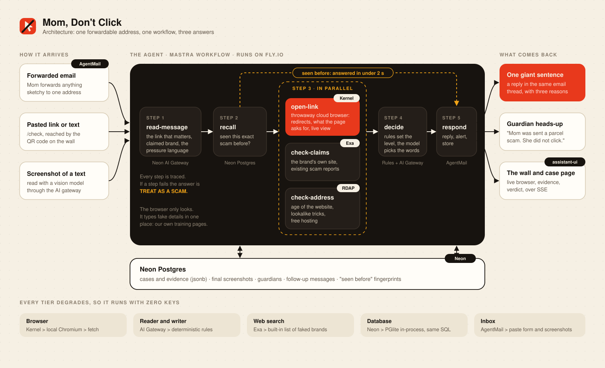
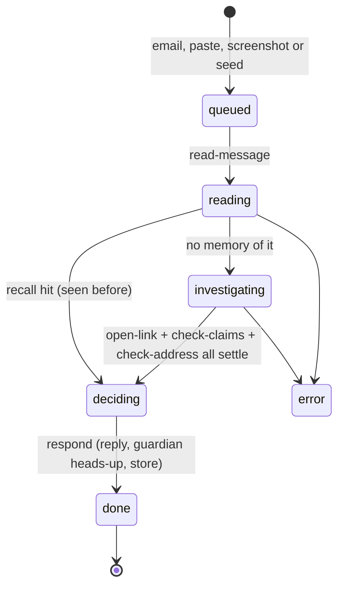

# Architecture

How Mom, Don't Click is put together, and why.



## One process, three jobs

The whole product is a single Next.js server.

| Job | Where | Notes |
| --- | --- | --- |
| **Screens and JSON API** | `src/app` | App Router pages and route handlers |
| **The agent** | `src/lib/pipeline.ts` | A Mastra workflow started per case, in the background |
| **The inbox poller** | `src/lib/boot.ts` | Started once from `src/instrumentation.ts`; lists the AgentMail inbox every 2.5 seconds |

Live state fans out in-process (`src/lib/bus.ts`) to every open Server-Sent Events connection, which is why the deployment is one machine on purpose.

## The life of a case



A `CaseRecord` (`src/lib/types.ts`) is the single document that moves through this. Every change is:

1. written to the in-memory cache,
2. broadcast as a `case` event (with the forwarded text stripped and the sender masked),
3. queued for an upsert into Postgres, in order, per case.

Screens never poll for state. They read the `hello` snapshot when the stream opens and then apply events.

## The workflow

```
read-message ──► recall ──► ┌ open-link     ┐
                            ├ check-claims  ├──► decide ──► respond
                            └ check-address ┘
```

| Step | Tool | Input | Output |
| --- | --- | --- | --- |
| `read-message` | Neon AI Gateway, with rules as the floor | subject, text, HTML, or an image | the link the sender wants clicked, the brand being claimed, category, pressure phrases, a sanitised subject |
| `recall` | Neon Postgres | fingerprints: domain, phone number, text hash | a previous SCAM / TREAT AS A SCAM verdict for the same thing, if any |
| `open-link` | Kernel (then local Chromium, then fetch) | the link | redirect chain, final address, what each step asks for, a screenshot with the sensitive fields boxed, a live frame stream |
| `check-claims` | Exa (then a built-in list) | the claimed brand, the category, pressure phrases | the brand's own domain, or "no such company"; existing scam reports |
| `check-address` | RDAP + string checks | the link | age of the domain, lookalike tricks, free hosting, risky endings |
| `decide` | rules, then the model for wording | all evidence | level, one sentence, three reasons, what to do instead |
| `respond` | AgentMail | the verdict | threaded reply, guardian heads-up, stored case |

The steps are plain async functions over a per-run context. Mastra provides the orchestration (`.then().parallel().then()`), and the same functions run directly if the workflow engine is unavailable, so a case never fails because of the orchestrator.

## Evidence, and how it becomes a verdict

Every finding is an `Evidence` item with a tone.

| Tone | Meaning | Examples |
| --- | --- | --- |
| **red** | A strong tell | The page asks for a card number. Not the brand's own website. Asks for gift cards. The website was created 6 days ago. |
| **amber** | A weaker tell | Pressure to act fast. The link is dead. Hosted on free web space. Ends in `.top`. |
| **calm** | Counts in its favour | The link goes to the brand's own website. |
| **neutral** | Just a fact | The page loaded and asked for nothing. |

`decideLevel()` in `src/lib/verdict.ts` is the whole policy:

| Evidence | Verdict |
| --- | --- |
| The link is the brand's own site, and no red | **NO RED FLAGS FOUND** |
| Two or more red | **SCAM** |
| One red and at least one amber | **SCAM** |
| One red | **TREAT AS A SCAM** |
| A link that would not open | **TREAT AS A SCAM** |
| Two or more amber | **TREAT AS A SCAM** |
| An unknown site and any amber | **TREAT AS A SCAM** |
| Nothing | **NO RED FLAGS FOUND** |

The model is then asked to phrase a sentence that must begin with the level's opener. If it returns anything else, or uses a banned word, the template wording is used instead. A prompt injection inside a forwarded email can therefore change the wording at most, never the level.

## The browser

`detonate()` in `src/lib/browser.ts` picks the best tier available and falls down a tier if one fails.

| Tier | When | What you get |
| --- | --- | --- |
| **Kernel** | `KERNEL_API_KEY` set | A disposable cloud browser over CDP, a live view, a warm session kept ready |
| **Local Chromium** | No Kernel key, Chromium installed | A fresh incognito context per case, a screenshot stream |
| **Safe fetch** | Neither | Redirects followed by hand, HTML parsed for sensitive fields |

Rules that hold on every tier:

- **Looking only.** On third-party pages the browser navigates, scrolls and reads the DOM. It never types and never clicks.
- **The canary walk** (typing obviously fake details and pressing the page's own button, once) runs only when the address is this app's own host and the path starts with `/fake/`.
- **A 30 second budget.** A page that never finishes becomes evidence, not an error.
- **No reaching inward.** From the local tiers, the first address must resolve to a public IP, and every sub-request to a private address is aborted.

## Memory

"Seen before" uses up to three fingerprints per case, most specific first: the registrable domain of the link, the phone number when there is no link, and a hash of the normalised text. A match against a scam verdict from the last seven days short-circuits the workflow: the verdict, reasons and strongest evidence are copied, and the case finishes in well under two seconds.

## Data

Five small tables, created on first use (`src/lib/db.ts`). The same SQL runs on Neon and on PGlite.

| Table | Holds |
| --- | --- |
| `mdc_cases` | One row per case: indexed columns for lookups, the full `CaseRecord` as `jsonb` |
| `mdc_shots` | The final annotated screenshot per case |
| `mdc_messages` | Follow-up questions and answers |
| `mdc_guardians` | Who gets the heads-up for whom |
| `mdc_mail_seen`, `mdc_kv` | Processed message ids; the inbox address |

## Privacy

- The live stream and the case list never carry the forwarded text, and always mask the sender.
- The forwarded text is served only by `GET /api/cases/:id`, behind a 12-character random id.
- The wall shows a subject line with names, addresses, phone numbers and tracking codes removed.
- Guardian addresses are masked everywhere they are displayed.
- Suspicious addresses are printed defanged (`hxxps://evil[.]example`) and are never rendered as links.

## Guardian heads-up

A guardian is reached two ways: by email, and on their own `/guard` page while it is open (that page keeps a stream connection that tells the server it is listening). The case records an alert only when one of those actually delivered.

## Endpoints

| Method and path | Purpose |
| --- | --- |
| `GET /api/stream` | Server-Sent Events: `hello`, `case`, `frame`, `message`, `guardian`, `alert`, `eval`, `config`, `reset` |
| `POST /api/cases` | Start a case from a link, text, screenshot or example |
| `GET /api/cases/:id` | One case, with its follow-up messages |
| `GET /api/cases/:id/frame` | The newest live frame, or the final screenshot |
| `POST /api/cases/:id/chat` | A follow-up question, answered from the case's own evidence |
| `POST /api/guard`, `GET /api/guard` | Register a guardian; list them, masked |
| `POST /api/console/*` | Presenter controls: seeded emails, reset, settings |
| `POST /api/eval`, `GET /api/eval` | Run the labelled set; read the last report |
